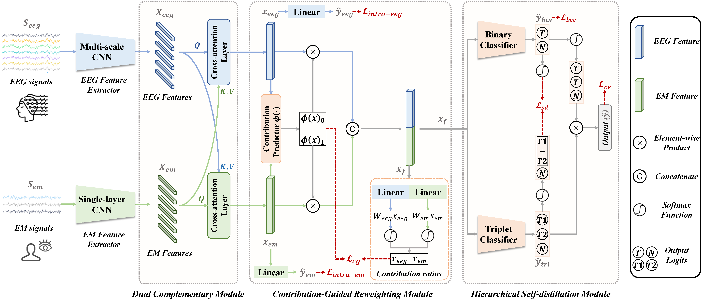

# MTREE-Net

The official implementation of **[Exploring EEG and Eye Movement Fusion for Multi-Class Target RSVP-BCI](https://doi.org/10.1016/j.inffus.2025.103135)**.



The MTREE-Net model consists of a two-stream feature extractor, a dual-complementary module (DCM), a contribution-guided reweighting module (CG-RM), and a hierarchical self-distillation module (HSM). The network employs several loss functions: intra-modal triplet cross-entropy losses (), binary cross-entropy loss (), triplet cross-entropy loss (), contribution-guided loss with L1-norm (), self-distillation loss using symmetric Kullback-Leibler divergence (). The output logits **T**, **N**, **T1**, and **T2** correspond to **target**, **non-target**, **target-1**, and **target-2** classes, respectively.


## 1&nbsp; Installation

Follow the steps below to prepare the virtual environment.

Create and activate the environment:
```shell
conda create -n mtreenet python=3.10
conda activate mtreenet
```

Install dependencies:
```shell
pip install -r requirements.txt
```


## 2&nbsp; Data

### 2.1&nbsp; Dataset

We designed and implemented three independent multi-class target RSVP tasks to collect EEG and EM data, and establish the “NeuBCI Multi-Class Target Detection RSVP EEG and EM Dataset”. Our collected dataset and corresponding data descriptions are released at [https://doi.org/10.57760/sciencedb.17705](https://doi.org/10.57760/sciencedb.17705).

Each participant's **electroencephalogram (EEG) data** are stored in `.npz` files, and **eye movement (EM) data** are stored in `.mat` files. Each EEG and EM file with the same file name corresponds to the same participant and block. Below is the dataset structure:

| Task | Modality | File Format | File Naming | Data Shape | Label Description |
|------|----------|-------------|-------------|------------|-------------------|
| A    | EEG      | `.npz`       | `S1_1.npz` ~ `S43_5.npz` | `(trials × channels × time)` | `0`: non-target, `1`: target-1, `2`: target-2 |
| A    | EM       | `.mat`       | `S1_1.mat` ~ `S43_5.mat` | `(trials × time × components)` | `0`: non-target, `1`: target-1, `2`: target-2 |
| B    | EEG      | `.npz`       | `S1_1.npz` ~ `S43_5.npz` | `(trials × channels × time)` | `0`: non-target, `1`: target-1, `2`: target-2 |
| B    | EM       | `.mat`       | `S1_1.mat` ~ `S43_5.mat` | `(trials × time × components)` | `0`: non-target, `1`: target-1, `2`: target-2 |
| C    | EEG      | `.npz`       | `S1_1.npz` ~ `S43_5.npz` | `(trials × channels × time)` | `0`: non-target, `1`: target-1, `2`: target-2 |
| C    | EM       | `.mat`       | `S1_1.mat` ~ `S43_5.mat` | `(trials × time × components)` | `0`: non-target, `1`: target-1, `2`: target-2 |

```
/data 
┣ 📂 TaskA 
┃   ┣ 📂 EEG 
┃   ┃   ┣ 📜 S1_1.npz 
┃   ┃   ┣ 📜 S1_2.npz 
┃   ┃   ┣ 📜 ... 
┃   ┃   ┣ 📜 S43_5.npz 
┃   ┣ 📂 EM 
┃   ┃   ┣ 📜 S1_1.mat 
┃   ┃   ┣ 📜 S1_2.mat 
┃   ┃   ┣ 📜 ... 
┃   ┃   ┣ 📜 S43_5.mat

┣ 📂 TaskB 
┃   ┣ 📂 EEG 
┃   ┃   ┣ 📜 S1_1.npz 
┃   ┃   ┣ 📜 S1_2.npz 
┃   ┃   ┣ 📜 ... 
┃   ┃   ┣ 📜 S43_5.npz 
┃   ┣ 📂 EM 
┃   ┃   ┣ 📜 S1_1.mat 
┃   ┃   ┣ 📜 S1_2.mat 
┃   ┃   ┣ 📜 ... 
┃   ┃   ┣ 📜 S43_5.mat

┣ 📂 TaskC 
┃   ┣ 📂 EEG 
┃   ┃   ┣ 📜 S1_1.npz 
┃   ┃   ┣ 📜 S1_2.npz 
┃   ┃   ┣ 📜 ... 
┃   ┃   ┣ 📜 S43_5.npz 
┃   ┣ 📂 EM 
┃   ┃   ┣ 📜 S1_1.mat 
┃   ┃   ┣ 📜 S1_2.mat 
┃   ┃   ┣ 📜 ... 
┃   ┃   ┣ 📜 S43_5.mat
```

### 2.2&nbsp; Data Acquisition

>- The EEG data are recorded using a SynAmp2 Amplifier (NeuroScan, Australia) with a 64-channel Ag/AgCl electrode cap following the international 10-20 system. The electrode impedances are maintained below 10 kΩ, with AFz serving as the ground electrode and the vertex as the reference. Data are sampled at 1000 Hz. Both EEG and eye movement signals are recorded simultaneously during the experiment. 

>- Bilateral eye movements including pupil pixel area, horizontal (X), and vertical (Y) gaze coordinates are recorded using an EyeLink 1000 plus system (SR Research) at the same sampling rate of 1000 Hz. A chin rest is used to minimize head movement while maintaining attention on the target images. Before data collection, eye tracking is calibrated using a 9-point grid, with maximum and average errors below 1◦ and 0.5◦, respectively.


### 2.3&nbsp; Data Preprocessing

The preprocessing stage has two main parts. Initially, both EEG and eye movement (EM) signals are down-sampled to 128 Hz, with EEG data additionally filtered through a third-order Butterworth bandpass filter (0.5-15 Hz). Subsequently, the continuous EEG and EM data are segmented into trials from the onset of the presented image to 1000 ms after the onset, and the EEG data of -200-0 ms are used for baseline correction. The processed dataset contains 5000 paired EEG-EM samples per subject in each task, where the number of target-1 samples and target-2 samples are both around 300, and the remaining samples are non-target.


## 3&nbsp; Train

The MTREE-Net is optimized using the Adam optimizer. The model assessment follows within-subject decoding settings using the cross-validation strategy. Each subject consists of five blocks, with each block containing 1,000 EEG-EM sample pairs, where around 3% are target-1 samples, 3% are target-2 samples, and the remaining 94% are non-target samples. For each subject, we employ a 5-fold cross-validation to partition experimental blocks into training and test sets. Each block serves as the test set once, while the remaining blocks form the training set. Each fold contains approximately 30 target-1 samples, 30 target-2 samples, and 940 non-target samples. Within each training set,
a secondary 5-fold cross-validation is applied to subdivide the training data into training and validation sets.

```bash
python /MTREE-Net/main.py
```

## 4&nbsp; Cite

If you find this code or our MTREE-Net paper helpful for your research, please cite our paper:

```bibtex
@article{li2025exploring,
  title={Exploring EEG and Eye Movement Fusion for Multi-Class Target RSVP-BCI},
  author={Li, Xujin and Wei, Wei and Zhao, Kun and Mao, Jiayu and Lu, Yizhuo and Qiu, Shuang and He, Huiguang},
  journal={arXiv preprint arXiv:2501.03596},
  year={2025}
}
```
